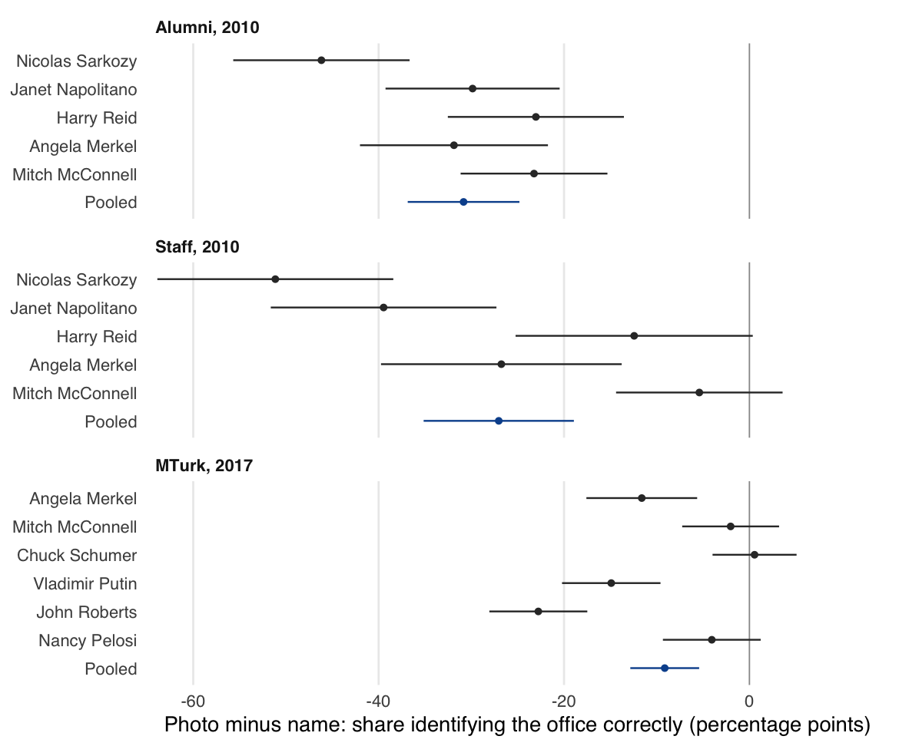

## Mis-measuring Political Knowledge? Do People Know More—or Even Less—about Politics than Commonly Thought?

Robert C. Luskin, Gaurav Sood, and Daniel Weitzel

Revisionist studies argue that surveys understate what the public knows about
politics: don't-know answers hide knowledge, open-ended coding misses partial
knowledge, and text questions miss what people recognize by sight. The paper
weighs those claims against the biases that run the other way (guessing,
inference, looking answers up, easy items, knowledgeable samples). It uses
randomized experiments in three online surveys and a recount of ANES and NAES
items and don't-know probes. Hidden knowledge turns out to be scarce:

- asking people to identify officials from photos lowers correct answers;
- menus and probes add little beyond what guessing produces;
- asking how sure people are finds much less knowledge than multiple choice.

<p align="center">
  
</p>

### Repository

| Path | Contents |
|---|---|
| `data/raw/` | Survey files and public-poll extracts; see [data/README.md](data/README.md) |
| `docs/open_codes.csv` | The rules that code every open-ended answer (correct, partial, incorrect, don't know) |
| `docs/item_decisions.csv` | Items dropped or not scored, and why |
| `docs/knowledge_items.csv`, `docs/knowledge_items_rules.md` | ANES 2012 and 2016 knowledge items and how their design features are coded |
| `docs/probe_items.csv` | ANES and NAES probe items: wording, fielding dates, answer keys and sources |
| `docs/naes_probe.csv` | Item-level NAES summaries (the NAES microdata may not be redistributed) |
| `docs/citations.csv` | How each cited work was checked |
| `R/` | Reading and checking data (`sources.R`), open-ended coding (`coding.R`), estimates (`analysis.R`), ANES/NAES probes (`probes.R`), ANES item corpus (`corpus.R`), labels, figure style, table output |
| `scripts/` | `run_all.R` writes `tabs/*.csv`; `figures.R` writes `figs/`; `tables.R` writes LaTeX tables and number macros; `extract_public_polls.R` rebuilds the ANES/NAES extracts from the original files |
| `tabs/open_answers.csv` | Every distinct open-ended answer with its code, for review |
| `ms/` | `main.tex`, `references.bib`, and the compiled `main.pdf` |
| `tests/testthat/` | Coding-rule unit tests, reproductions of earlier numbers where the codings should agree, and privacy checks |

### Running it

```
make restore   # install the package versions in renv.lock
make check     # analysis, figures, tables, manuscript, lint, tests
```

The manuscript needs XeLaTeX and latexmk. Every number in the text comes from
`tabs/macros.tex`, which `scripts/tables.R` writes from the analysis output.
