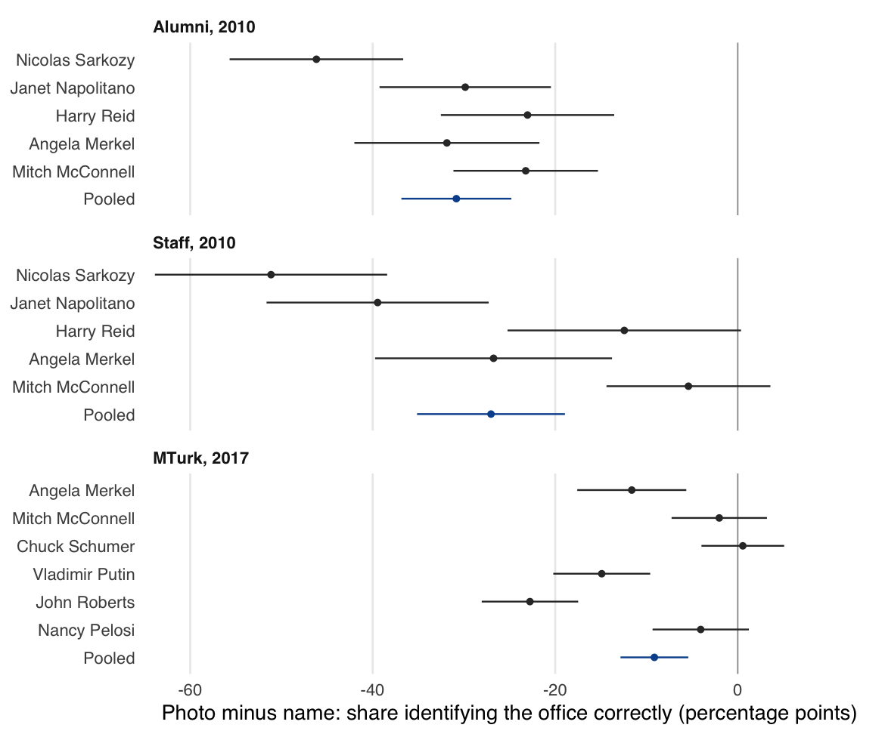

## Mis-measuring Political Knowledge? Do People Know More—or Even Less—about Politics than Commonly Thought?

Robert C. Luskin, Gaurav Sood, and Daniel Weitzel

Revisionist studies argue that surveys understate what the public knows about
politics: don't-know answers hide knowledge, open-ended coding misses partial
knowledge, and text questions miss what people recognize by sight. The paper
weighs those claims against the biases that run the other way (guessing,
inference, looking answers up, easy items, knowledgeable samples). It uses
randomized experiments in three online surveys and a recount of ANES and NAES
items and don't-know probes. Hidden knowledge turns out to be scarce:

- asking people to identify officials from photos lowers correct answers;
- menus and probes add little beyond what guessing produces;
- asking how sure people are finds much less knowledge than multiple choice.

<p align="center">
  
</p>

### Repository

| Path | Contents |
|---|---|
| `data/raw/` | Survey files and public-poll extracts; see [data/README.md](data/README.md) |
| `docs/open_codes.csv` | The rules that code every open-ended answer (correct, partial, incorrect, don't know) |
| `docs/item_decisions.csv` | Items dropped or not scored, and why |
| `docs/knowledge_items.csv`, `docs/knowledge_items_rules.md` | ANES 2012 and 2016 knowledge items and how their design features are coded |
| `docs/probe_items.csv` | ANES and NAES probe items: wording, fielding dates, answer keys and sources |
| `docs/naes_probe.csv` | Item-level NAES summaries (the NAES microdata may not be redistributed) |
| `docs/citations.csv` | How each cited work was checked |
| `R/` | Reusable data, coding, estimation, probe, corpus, and output functions; the numbered original-data extractor described below. |
| `scripts/` | Configuration and numbered execution stages, listed below. |
| `data/derived/` | Generated intermediate data; ignored by Git. |
| `tabs/open_answers.csv` | Every distinct open-ended answer with its code, for review |
| `ms/` | `main.tex`, `references.bib`, and the compiled `main.pdf` |
| `tests/testthat/` | Coding-rule unit tests, reproductions of earlier numbers where the codings should agree, and privacy checks |

### Running it

```
make restore
make check
```

The manuscript needs XeLaTeX and latexmk. Every number in the text comes from
`tabs/macros.tex`, which `scripts/04_tables.R` writes from the analysis output.

`make restore` installs the package versions in `renv.lock`. `make check` rebuilds the analysis and manuscript, lints the R code, and runs the tests. Use R 4.6. `make ci-docker` runs the checks in the project's standard Rocker image.

### Script organization

`make analysis` runs `scripts/99_run_all.R`. It loads the configuration and the named reusable modules in `R/`, then executes stages 01–04 in separate environments. Stages pass results through files.

| File | Purpose |
|---|---|
| `scripts/00_config.R` | Paths, source hashes, labels, colors, `theme_paper()`, figure sizes, and `table_style`. |
| `scripts/01_prepare_data.R` | Verify and read source data, recode probe responses, and save `data/derived/prepared_data.rds`. |
| `scripts/02_estimate.R` | Read the prepared data and write estimates to `tabs/*.csv`. |
| `scripts/03_figures.R` | Read the estimates and write PDF and PNG figures to `figs/`. |
| `scripts/04_tables.R` | Generate LaTeX tables, manuscript numbers, and `tabs/style.tex`. |
| `scripts/99_run_all.R` | Run all stages in order. |

Plot and table defaults live in `00_config.R`. The manuscript applies the generated `\TableStyle` to each table. Reusable functions stay in the named `R/` modules so tests can call them directly.

`R/01_extract_public_polls.R` rebuilds the survey extracts from the original ANES and NAES files; its header gives the command and required inputs. It is not loaded by the public analysis or tests. The public pipeline uses the committed NAES summaries when the restricted microdata are absent and writes the selected summaries to `tabs/naes_probe.csv`. With the restricted extracts available locally, it recomputes those summaries. Neither path overwrites the source documentation. The two NAES microdata tests are skipped when those files are absent.
